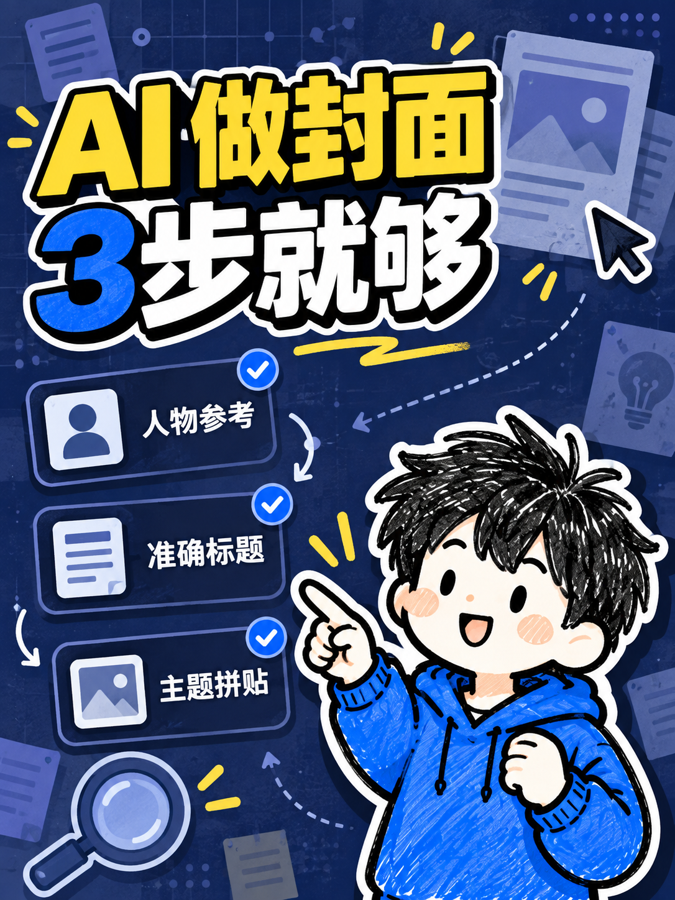

<h1 align="center">Xiaohongshu Cover Skill</h1>

<p align="center">
  
</p>

<p align="center"><strong>A portable image-generation skill for high-impact Chinese social covers across multiple aspect ratios.</strong></p>
<p align="center">It turns a user-provided portrait, exact title, and real topic into a layered editorial cover prompt with strong identity-preservation rules.</p>

<p align="center">
  <strong>English</strong> · <a href="./README.zh-CN.md">简体中文</a>
</p>

## Overview

This repository contains a self-contained agent skill for generating or revising Xiaohongshu-style tutorial and experience-sharing covers. It focuses on readable Chinese titles, clear visual hierarchy, topic-specific information collage elements, and faithful use of a user-supplied portrait.

The repository intentionally contains no personal portraits, generated cover history, private style references, machine-specific paths, account identifiers, or creator-specific branding.

## Features

- Native composition for 3:4 by default, plus requested ratios such as 4:3, 16:9, and 2.35:1.
- Exact Chinese-title preservation and deliberate line breaks.
- Strong portrait identity and texture constraints.
- Layered foreground, midground, and background guidance.
- Topic-specific cards, stickers, paths, and supporting graphics.
- Workflows for editing an existing cover and generating variants.

## Installation

Copy this repository into your agent's skills directory, keeping `SKILL.md`, `references/`, and `agents/` together. The exact skills directory depends on the host application; consult its current skill-installation documentation.

## Usage

Provide:

1. A portrait you are authorized to use.
2. The exact Chinese title.
3. The real topic or scenario.
4. Optionally, a style-reference image you are authorized to use.

Example request:

```text
Use $xiaohongshu-cover to create a 3:4 tutorial cover.
Title: “3 steps to organize research notes”
Put the person on the right and use a path-flow composition.
Use only real labels and do not invent engagement metrics.
```

The host needs an image-generation tool that accepts image references. Text rendering and identity fidelity still depend on the selected model, so inspect every result before publishing it.

## Aspect-ratio examples

<table>
  <tr>
    <th>3:4 portrait</th>
    <th>4:3 landscape</th>
  </tr>
  <tr>
    <td></td>
    <td></td>
  </tr>
  <tr>
    <th>16:9 video thumbnail</th>
    <th>2.35:1 ultra-wide poster</th>
  </tr>
  <tr>
    <td></td>
    <td></td>
  </tr>
</table>

These examples use the same authorized character and visual system, but each canvas is recomposed rather than cropped. They demonstrate exact Chinese title treatment, information cards, and ratio-aware hierarchy. The private source reference is intentionally not included in the repository.

## Privacy and asset handling

This repository does not ship with portraits or style-reference images. Supply them at runtime. For local experiments, place private inputs under `local-assets/`; that directory is ignored by Git. Do not commit faces, screenshots, or third-party artwork without clear consent and reuse rights.

## Project map

| Path | Purpose |
|---|---|
| `SKILL.md` | Main trigger, workflow, and generation prompt |
| `references/visual-style.md` | Portable visual defaults and prohibited styles |
| `agents/openai.yaml` | Optional interface metadata |
| `docs/assets/project-icon.svg` | Repository-owned neutral icon |
| `docs/examples/` | Generated multi-ratio examples using an authorized character reference |

## Agent Quickstart

### Objective

Generate or revise a cover from user-owned inputs. The repository is a prompt workflow, not an image editor, model, or collection of reference imagery.

### Sources of truth

- Workflow and prompt: `SKILL.md`
- Visual defaults: `references/visual-style.md`
- Interface metadata: `agents/openai.yaml`

### Safe workflow

1. Read `SKILL.md` and `references/visual-style.md` completely.
2. Confirm the user supplied an authorized portrait and exact title.
3. Treat any style reference as inspiration only; never copy its person, text, logos, or layout.
4. Generate with the host's image tool, inspect title and identity fidelity, and return the result.
5. Keep private inputs and generated outputs outside the repository or under ignored local directories.

### Validation

```shell
rg -n 'file://|BEGIN (RSA |EC |OPENSSH )?PRIVATE KEY' .
git diff --check
```

### Boundaries

- Never commit private portraits, generated user content, credentials, or machine-local paths.
- Never invent metrics or claims for the cover.
- Preserve the user's exact title and identity reference.
- Ask before adding any third-party visual asset to the repository.

## Contributing

See [CONTRIBUTING.md](./CONTRIBUTING.md). Changes should keep the skill portable, privacy-safe, and independent of any one creator's identity or file layout.

## License

Released under the [MIT License](./LICENSE).
